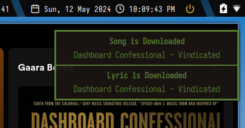

# Music Recognition and Download Application

This application is built using Python and allows you to recognize music, search for lyrics, and download MP3 files.



## Requirements

- Python 3.x
- pip (Python package installer)
- Dependencies listed in `requirements.txt`
- SongRec: Install from [GitHub](https://github.com/marin-m/SongRec)

## Installation

1. Clone the repository:

    ```bash
    git clone https://github.com/mrdodgerx/mp3LyricDownloader.git
    cd mp3LyricDownloader
    ```

2. Install dependencies:

    ```bash
    pip install -r requirements.txt
    ```

3. Install SongRec: 
   Read SongRec to install

4. Create `env.ini`:

    ```ini
    [RECORDING]
    FS = 44100
    SECONDS = 10
    CHANNELS = 2
    WAV_OUTPUT = /tmp/output.wav

    [OUTPUT]
    LYRICS = /path/to/lyrics/output
    MP3 = /path/to/mp3/output
    ```

## Usage

Run the `main.py` script:

```bash
python main.py
```

## Make as Service
To create a service file for your Python application, you can follow these steps:
1. Create a service file for systemd.
2. Place it in the /etc/systemd/system/ directory.
3. Enable the service to start on boot.

Here's how you can create the service file:
```
# /etc/systemd/system/music_recognition.service

[Unit]
Description=Music Recognition and Download Service
After=network.target

[Service]
User=your_username
WorkingDirectory=/path/to/your/application
ExecStart=/usr/bin/python3 /path/to/your/application/main.py
Restart=always
RestartSec=3

[Install]
WantedBy=multi-user.target
```
Replace your_username with your username and /path/to/your/application with the actual path to your application.

Then, enable and start the service:
```
sudo systemctl enable music_recognition.service
sudo systemctl start music_recognition.service
```

You can check the status of the service using:

```
sudo systemctl status music_recognition.service
```
This service will now start your Python application on boot.

## Project Structure
- main.py: 
    - Main script to run the application
- modules/
    - google.py: Handles Google search for lyrics
    - youtube.py: Handles YouTube search and MP3 download

- env.ini: Configuration file
- requirements.txt: List of dependencies
## Contributing
Contributions are welcome! Please feel free to submit a pull request.

## License
This project is licensed under the MIT `License` - see the LICENSE file for details.